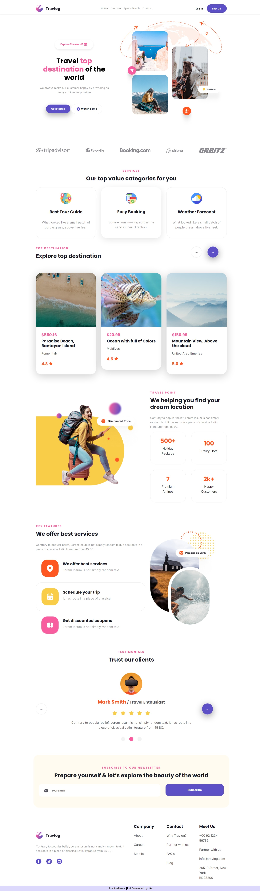
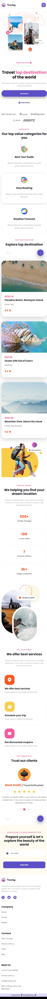

# Travlog - Responsive Travel Agency Landing Page

Travlog is a modern, responsive travel agency landing page built using HTML, CSS, and Bootstrap. This project was developed as part of the #30DaysOfCoding challenge by NxtWave. The design was inspired by a Figma template, which was translated into code to enhance front-end development skills and responsiveness.

# Features
 
✔️ Fully responsive design for mobile, tablet, and desktop views

✔️ Bootstrap-powered grid system and components

✔️ Modern and visually appealing layout

✔️ Well-structured and reusable code

# Tech Stack

**HTML** – Structuring the webpage

**CSS** – Custom styling and animations

**Bootstrap** – Responsive layout and UI components

# Live Demo

[ View Developed Travlog Landing Page ](https://travlog4sk.ccbp.tech/)

[ View Figma Inspiration File ](https://www.figma.com/community/file/1332575034408033885)

# Installation

 - Clone the repository:

 git clone https://github.com/your-username/travlog-reponsiveUI-html-css-bootstrap.git

 
 - Navigate to the project folder:

 cd travlog-reponsiveUI-html-css-bootstrap

 - Open travlog_resplandpage.html in your browser or use Live Server in VS Code.

# Result

- **Device Size**: Desktop (Large)

- **Device Size**: Tablet (Medium)

- **Device Size**: Mobile (Small)

